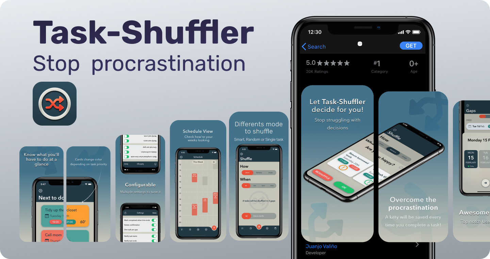

# Task-Shuffler

  
Task-Shuffler fills your spare time gaps with tasks defined by you.  
The target is to __avoid the procrastination__ by choosing for you what you have to do rather than struggling with decisions that end in doing absolutely nothing.  
It can be done random or choosing in a smart way.  
1- Enter your tasks.  
2- Choose your free time gaps in the week.  
3- Shuffle!  

  
